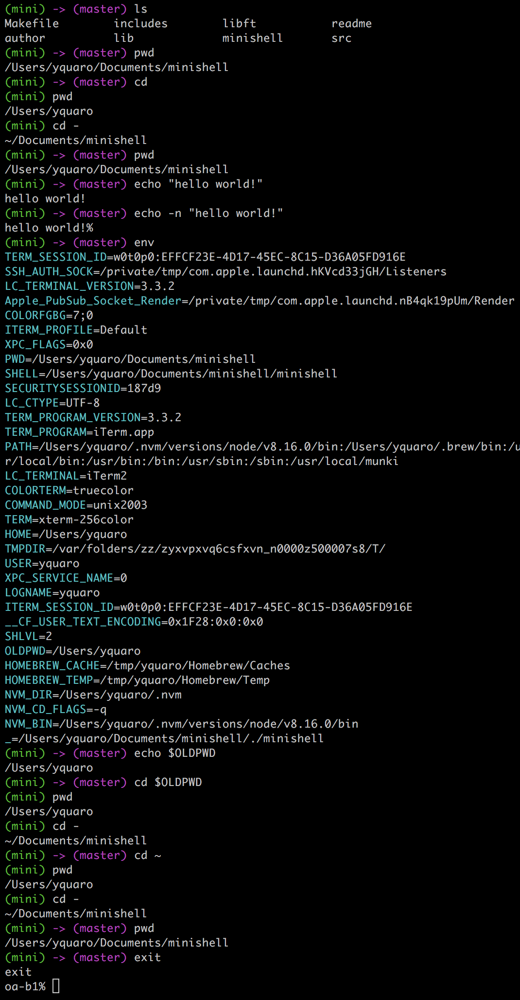
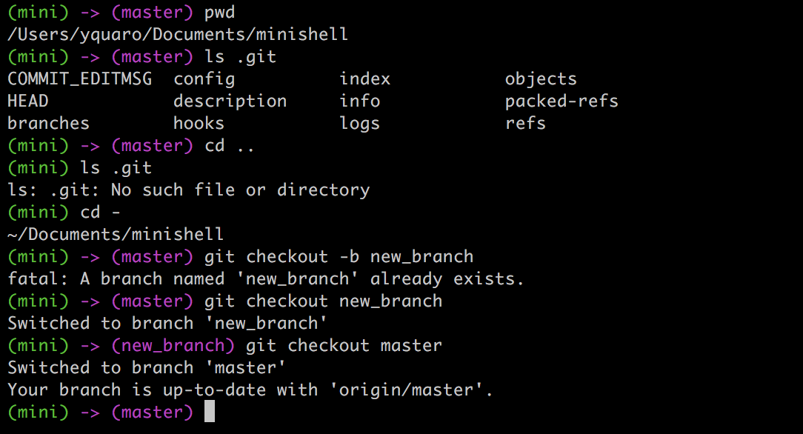
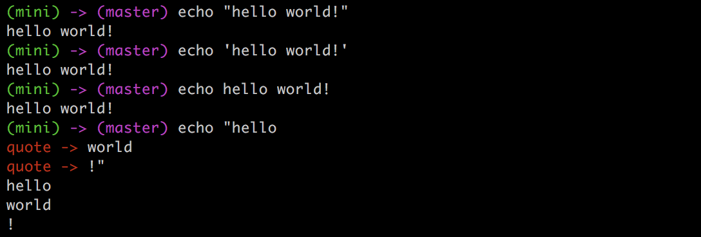
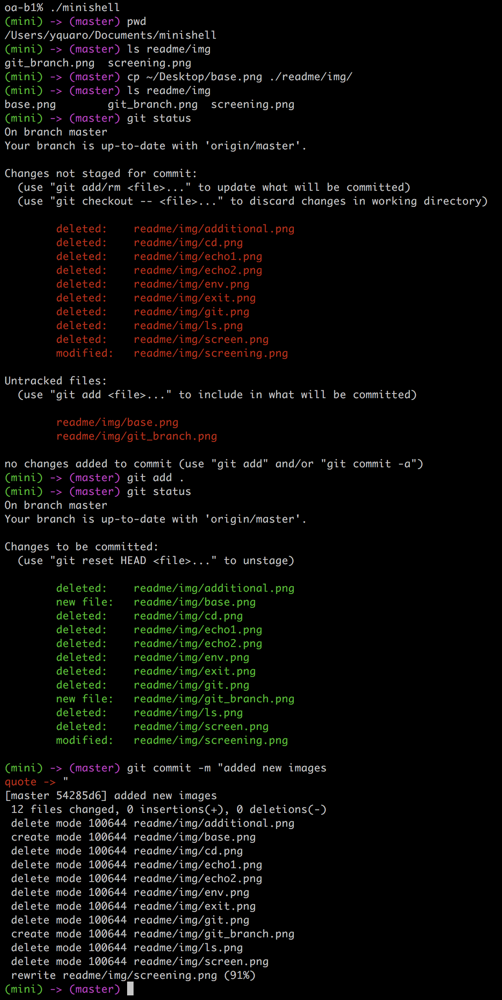

# minishell
Проект для знакомства с __UNIX__-подобными операционными системами

> Проект из [School21](https://21-school.ru/)

### Краткое описание задачи

Создать простейший интерпретатор команд __UNIX__.
Командные строки без pipe`ов, перенаправлений или каких-либо других расширенных функций.

* Этот интерпретатор должен отображать `prompt` (например, простое __«$>»__) и ждать, пока пользователь не введет командную строку.
* `Prompt` отображается снова только после полного выполнения команды.
* Правильная работа с `PATH` *(копия системной **environment)*.
* Реализовать ряд встроенных функций: `echo`, `cd`, `setenv`, `unsetenv`, `env`, `exit`.
* Обработка служебных символов `$` и `~`

*[(полное описание)](readme/subject/minishell.en.pdf)*

### Проект

#### Функционал по заданию:

#### Дополнительно добавлены:

* Обработка git ветки

* Обработка кавычек

`Minishell` работает со всеми системными командами (и их флагами), которые подключены в переменную окружения `PATH`.
Поддерживает многослойность (может запустить сам себя или любой другой `shell` внутри себя).

Утечки памяти проверялись с помощью `Leaks` и `valgrind`.

### Установка и запуск

1) `git clone https://github.com/qypec/minishell.git`

2) `make`

3) `./minishell`

*Разрабатывалось и тестировалось на MacOS Sierra*
